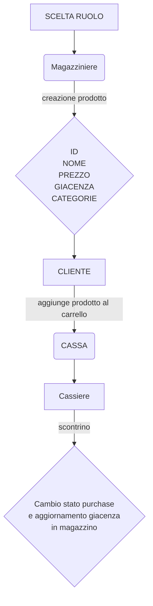

# SUPERMERCATO ADVANCED

Implementare le entità che compongono un supermercato.

> Partendo dalla soluzione dell'esercizio `27_Classi8parte` implementare le seguenti entità:
- **Dipendente**:
Avrà i campi (ID,nome,cognome) ed un campo`ruolo` di tipo `String` che rappresenta ill ruolo del dipendente (es. "cassiere","magazziniere")
Implementare i metodi `getRuolo` e `setRuolo`.


- Magazziniere: può aggiungere o rimuovere prodotti dal magazzino

- Amministratore: rappresenta un amministratore del supermercato. Un amministratore è un dipendente con ruolo "amministratore".
  Può impostare il ruolo dei dipendenti. Implementare il metodo setRuolo che accetta come parametri un dipendente e una stringa
  rappresentante il ruolo da assegnare al dipendente.

| Dipendente | Tipi di dato | Note |
| --- | --- | --- |
| ID | int | viene generato in automatico con un progressivo |
|cognome | String | viene assegnato dall' admin |
|ruolo | String| viene assegnato dall' admin e può essere magazziniere o cassiere |

| Cliente | Tipo di dato | Note |
| --- | --- | --- | 
| ID | int | viene generato in automatico con un progressivo |
| username | string |  ognuno decide come vuole farlo |
| carrello | prodotto[] | |
| storico acquisti | purchases[] | |
| percentuale sconto | int | viene incrementata a seconda del valore dello storico degli acquisti |
| credito | double | viene utilizzato per fare gli acquisti |

| Prodotto | Tipo di dato | Note |
| ---  | --- | --- |
| ID | int | viene generato in automatico con un progressivo |
| nome | string | viene inserito dal magazziniere |
| prezzo | double | viene inserito dal magazziniere |
| quantità | int | viene inserito dal magazziniere |
 | --- | --- |
 | categoria | ID |

Purchases è lo stato nel quale si trova l'acquisto di un cliente. Prima di essere passato in cassa.

 - Quando viene passato allo stato `completato` la cassa può processare lo scontrino.

 | Purchases | Tipo di dato | Note |
 | --- | --- |--- |
 | ID | int | viene generato in automatico con un progressivo |
| cliente | cliente | |
| prodotti | prodotto[] | viene inserito dal cliente |
| quantita | int | viene inserito dal cliente |
| data | Date | viene generato in automatico con la data corrente (quando il cliente completa l'acquisto) |
| stato | Bool | lo stato di un acquisto di default e `in corso` e può essere modificato dal cliente in `completato` o `annullato` |

| Cassa | Tipo di dato | Note |
| --- | --- | --- |
| ID | int | viene generato in automatico con un progressivo |
| dipendente | Dipendente | |
| acquisti | purchases[] | |
| scontrino processato | bool | di default è `false` e diventa `true` quando la cassa ha processato lo scontrino|


- Ruoli:


| **Cassiere** | **Magazziniere** | **Amministratore** | **Cliente** |
| --- | --- | --- | --- |
| Può registrare i prodotti acquistati da un cliente che ha degli acquisti in stato completato e calcolare il totale da pagare generando lo scontrino | Può visualizzare, aggiungere o rimuovere prodotti dal magazzino, può gestire le categorie |  Può impostare il ruolo dei dipendenti. | Può aggiungere o rimuovere prodotti e cambiare lo stato dell'ordine.

# Diagramma prodotto
- Dall'inserimento del prodotto in magazzino, alla fine dell' acquisto.


# Documentazione
### Ho creato la cartella 'Models' in cui ho inserito i modelli .cs:
- Cassa.cs
- Categoria.cs
- Cliente.cs
- Dipendente.cs
- Prodotto.cs
- Purchase.cs

<details>
<summary>Ho completato:</summary>

- [ ] Cassa
- [x] Categoria
- [x] Cliente
- [x] Dipendente
- [x] Prodotto
- [x] Purchase
</details>

### Ho creato la cartella Repositories in cui ho inserito i repositories:
- CarrelloRepository.cs
- ClienteRepository.cs
- DipendenteRepository.cs
- ProdottoRepository.cs
- PurchaseRepository.cs
- CategoriaRepository.cs

<details>
<summary>Ho completato:</summary>

- [x] CarrelloRepository.cs
- [x] ClienteRepository.cs
- [x] DipendenteRepository.cs
- [x] ProdottoRepository.cs
- [x] PurchaseRepository.cs
- [x] CategoriaRepository.cs
</details>

### Ho creato la cartella Manager per:                                 
- ManagerCarrello.cs                                              
- ManagerCliente.cs                                                     
- ManagerDipendente.cs                                                
- ManagerProdotto.cs  
- ManagerPurchase.cs  
- ManagerCategoria.cs

<details>
<summary>Ho completato:</summary>

- [x] ManagerCarrello.cs
- [x] ManagerCliente.cs
- [x] ManagerDipendente.cs 
- [x] ManagerProdotto.cs 
- [x] ManagerPurchase.cs
- [x] ManagerCategoria.cs
</details> 

### Ho inserito i menu per:                                          
- Il dipendente                                                    
- Il cliente                                                       
- Il magazziniere                                                  
- L' Amministratore 
- Il cassiere

<details>
<summary>Ho completato:</summary>                                            

 - [ ] Il cassiere
 - [x] Il cliente
 - [x] Il magazziniere
 - [x] L' Amministratore
 </details> 

### Nella cartella `'Utilities'` ho inserito nel codice `'InputManager.cs'`, la funzione `LeggiDouble`, che prima non c'era, per riuscire a convertire `cliente.Credito` che mi dava problemi in `AggiornaCliente (int id, Cliente nuovoCliente)` .
Per scrivere il codice della conversione in double, ho adattato il codice della conversione del decimale.  Quindi:

```csharp
public static double LeggiDouble(string messaggio, double min = double.MinValue, double max = double.MaxValue)
    {
        double valore; //variabile per memorizzare il valore double acquisito
        while (true)
        {
            Console.Write($"{messaggio}");
            string input = Console.ReadLine();
            if (input.Contains(","))
            {
                input = input.Replace(".", ".");

                // try parse per convertire la stringa in un double e controllare se l'input è valido
                if (double.TryParse(input, out valore) && valore >= min && valore <= max)
                {
                    return valore;
                }
                else
                {
                    Console.WriteLine($"errore: inserire un numero double compreso tra {min} e {max}");
                }
            }
        }
    }
 ```

```csharp
 public void AggiornaCliente(int id, Cliente nuovoCliente)
    {
        var cliente = TrovaCliente(id);
        if (cliente != null)
        {
            
            cliente.UserName = InputManager.LeggiStringa("Inserisci nuovo UserName: ");
            cliente.StoricoAcquisti = nuovoCliente.StoricoAcquisti;
            cliente.PercentualeSconto = nuovoCliente.PercentualeSconto;
            cliente.Credito = InputManager.LeggiDouble(" Inserisci nuovo credito: ");
        }
    }
 ```
- [X] Risolto il bug che impediva di rivisualizzare il menu dopo essere usciti (una volta usciti bisognava ripetere l'identificazione e non si poteva invece visualizzare ancora il menu interessato).
- [x] Completata la parte delle operazione CRUD del magazziniere e dell'Amministratore.
- [x] Ho scritto la funzione ImpostaRuolo per impostare il ruolo del dipendente tramite il suo ID.
- [x] Completato tutto il menu dell'amministratore
- [X] Ho aggiunto il bool ContinuaCliente ed ho sistemato il while all'interno dell'if.

Riscontravo un errore in ManagerCarrello, "Quantita" : `'Prodotto' non contiene una definizione di 'Quantita' e non è stato trovato alcun metodo di estensione accessibile 'Quantita' che accetta un primo argomento di tipo 'Prodotto'. Probabilmente manca una direttiva using o un riferimento all'assembly.`

```csharp
    public void VisualizzaCarrello(List<Prodotto> listaCarrello)
    {
        Console.WriteLine(
       $"{"Nome",-20} {"Prezzo",-10} {"Quantita",-10}"
     );
        Console.WriteLine(new string('-', 50)); // Linea separatrice

        // Stampa ogni prodotto con larghezza fissa
        foreach (var prodotti in listaCarrello)
        {
            Console.WriteLine(
                $" {prodotti.Nome,-20} {prodotti.Prezzo,-10} {prodotti.Quantita}"
            );
        }
    }
```
Corretto aggiungendo nel modello del prodotto:

```csharp 
public int Quantita { get; set; } 
```
In questo modo verrà visualizzato nel file del prodotto anche la quantità.

Sono andata a creare due nuovi metodi in ClienteRepository che sono 
```csharp
public void SalvaClienteSingolo(Cliente cliente)
    {
        if (!Directory.Exists(folderPath))
        {
            Directory.CreateDirectory(folderPath);
        }
        string filePath = Path.Combine(folderPath, $"{cliente.Id}.json"); //percorso del file JSON
        string jsonData = JsonConvert.SerializeObject(cliente, Formatting.Indented);
        File.WriteAllText(filePath, jsonData);
        Console.WriteLine($"Prodotto salvato in {filePath}: \n");
    }
 public Cliente CaricaClienteSingolo()//questo metodo carica un cliente singolo
    {
        if (Directory.Exists(folderPath))//legge tutto quello che c'è nel file del singolo cliente
        {
            string readJsonData = File.ReadAllText("Data/Cliente/1.json");
            Cliente cliente = JsonConvert.DeserializeObject<Cliente>(readJsonData);

            return cliente;// se la condizione è vera e lo trova
        }
        return null;//se non lo trova, ritorna l'avviso che non l'ha trovato
    }
```
Ho creato nel ManagerProdotto il metodo `StampaProdottiCliente`per mostrare al cliente solo il nome, il prezzo e la categoria dei prodotti.
```csharp
public void StampaProdottiCliente()
{
    // Intestazioni con larghezza fissa
    Console.WriteLine(
        $" {"Nome",-20} {"Prezzo",-10} {"Categoria", -10}"
    );
    Console.WriteLine(new string('-', 50)); // Linea separatrice

    // Stampa ogni prodotto con larghezza fissa
    foreach (var prodotto in prodotti)
    {
        Console.WriteLine(
            $"{prodotto.Nome,-20} {prodotto.Prezzo,-10} {prodotto.Categoria,-10}"
        );
    }
}
```
Ho implementato il menu del cliente:

- [x] Visualizza Catalogo (cioè i prodotti del supermercato con `StampaProdottiCliente`).
- [x] Aggiungi prodotto al carrello.
- [x] Elimina prodotto dal carrello.

- Attualmente quando elimino un prodotto dal carrello elimino qualunque sia la quantità inserita mentre più in là vorrei inserire la quantita specifica da eliminare.
- [x] Modifica effettuata.

- Vorrei che in visualizza carrello si vedesse anche il totale da pagare, attualmente si vede solo il singolo prezzo del prodotto.
- [x] Modifica effettuata.

Ho implementato il menu del cassiere con
- [x] Visualizza il carrello del cliente.
- [x] Aggiungi prodotto al carrello del cliente.
- [x] Elimina prodotto dal carrello del cliente.
(aggiunte superflue, è da implementare bene)

Ho implementato il menu del cliente :
- [x] Decremento della quantità del prodotto dalla giacenza.
- [x] Incremento della quantita del prodotto alla giacenza nel caso venisse rimosso dal carrello.
- [x] Procedimento del pagamento.
- [x] Aggiunta della data di acquisto nello StoricoAcquisti.
- [x] Aggiunta della data e dell'ora di acquisto nel Purchase.

Da sistemare :
- [x] Il cliente non deve essere creato manualmente, ma deve crearsi dall'input dell'utente.
- [x] L'amministratore non deve creare il cliente.
quindi eliminare dal menu le voci che riguardano il cliente.

Da fare ancora :
- [ ] Cassa.
- [ ] Menu cassiere.
- [x] Categorie.
 Per adesso sono riuscita ad assegnare la categoria ai prodotti e a salvarli nella cartella Prodotti, ma devo:
 - inserire ancora l'id
 - implementare tutte le sue funzioni nel main

 ### In sintesi, di tutto il programma mi mancano:
 - Cassa.
 - Cassiere (con relativo menu).
 - Implementare le funzioni della categoria nel main.
 - Sconti


