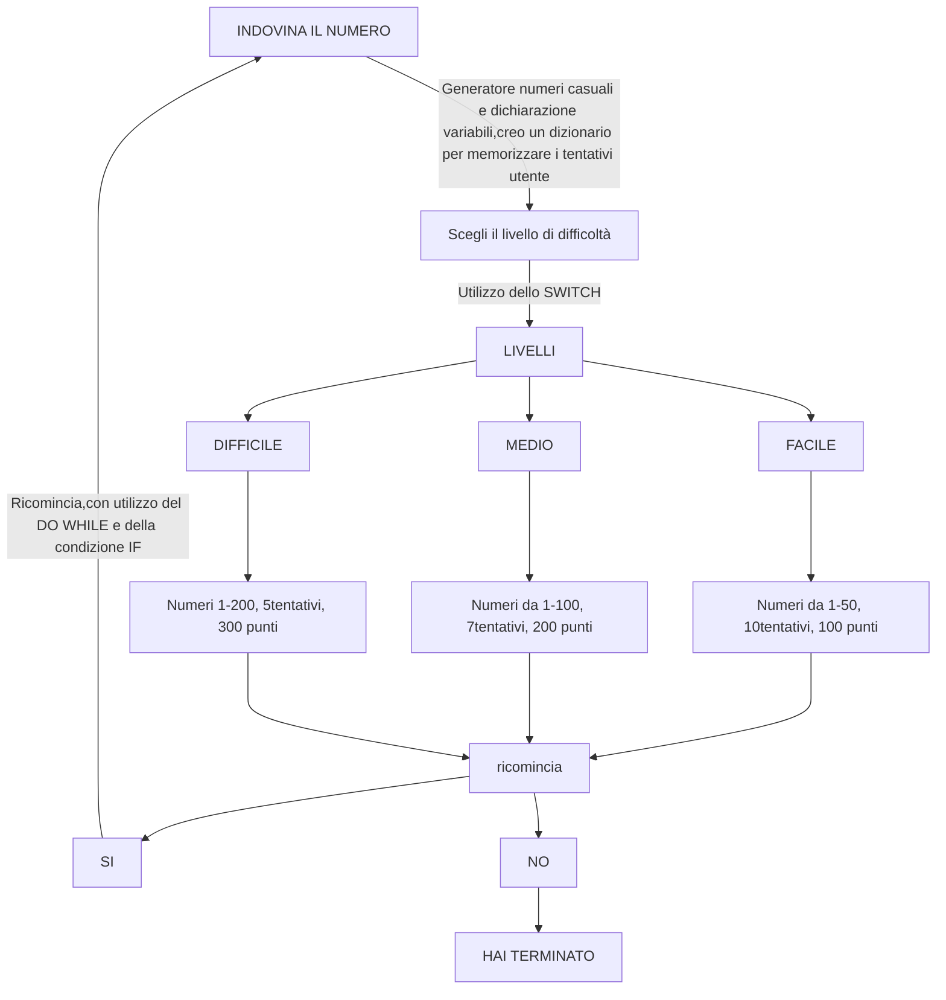
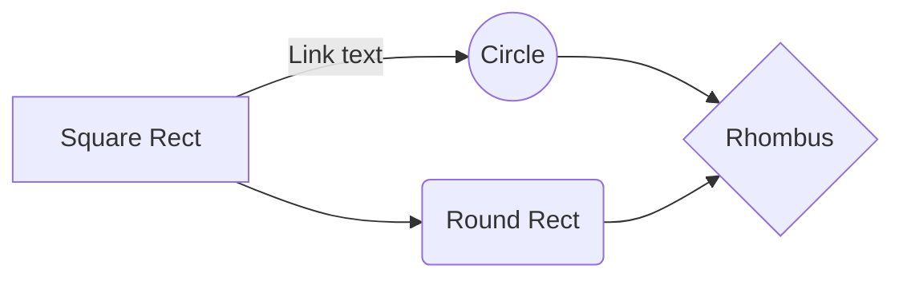
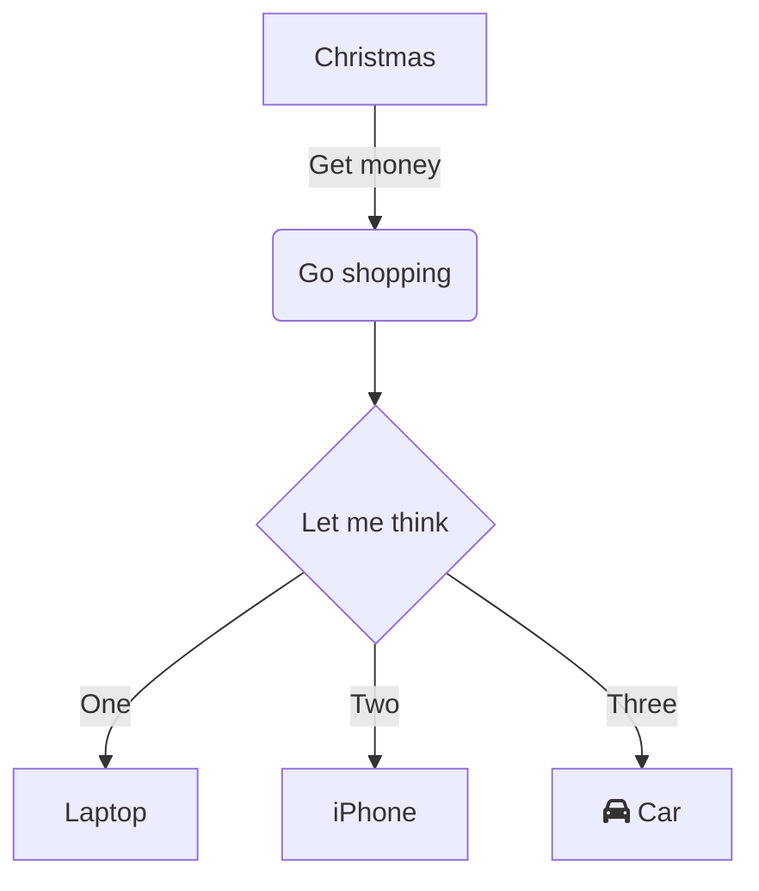
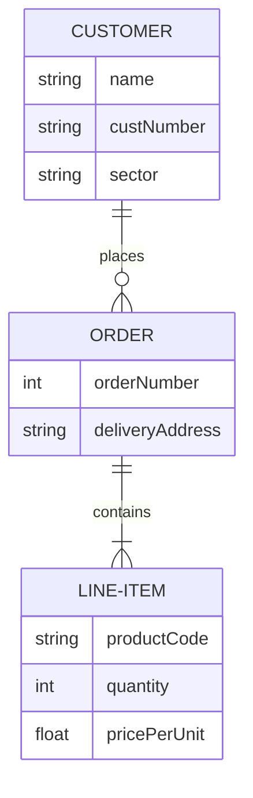
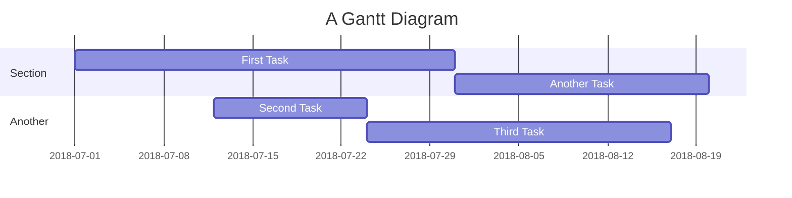
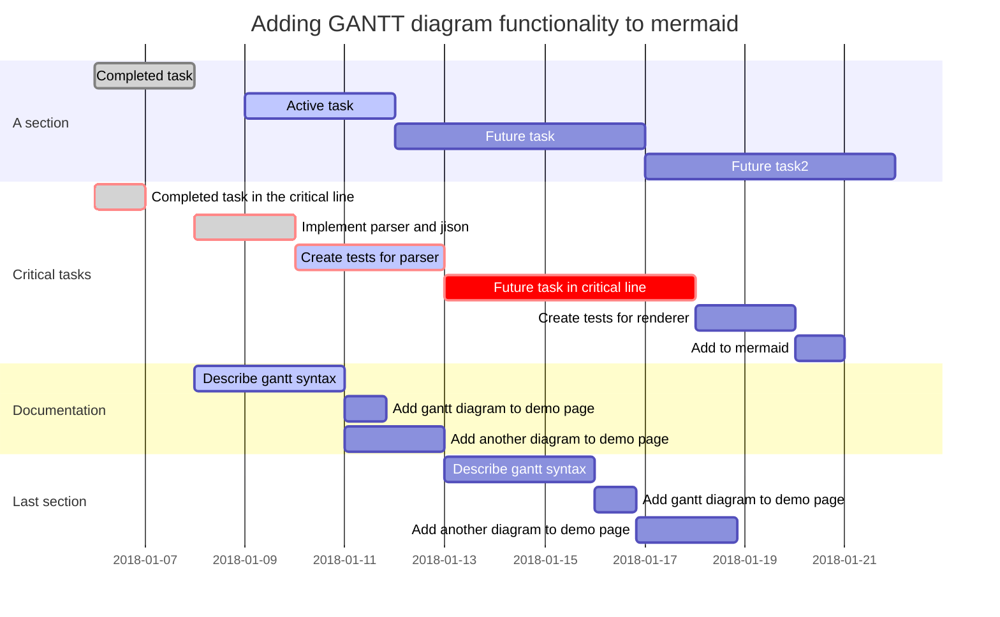

## UTILIZZO MD

# TITOLO PRINCIPALE

## Sottotitolo

### Titolo paragrafo

>esempio citazione

esempio di__grassetto__ o **bold**

esempio di _italic_

esempio di elenco
---

#### Sottotitolo paragrafo


# Esempio di elenco puntato
[link]
---
- primo
    - sottoelenco
- secondo
- terzo
# Esempio di elenco numerato
1. primo
2. secondo
3. terzo
    4. quarto
        5. quinto
            6. sesto

## Esempio di check

- [x] grewd
- [ ] primo
- [ ] secondo
- [x] terzo

# Esempio di codice
```
  git status
  git add
  git commit
 ```

```c#
class Program
{
    static void Main(string[] args)
    {
        Console.WriteLine("Hello, world!");
    }
}

/*
note per i collaboratori
*/
```

**esempio di link relativo**


[link a pagina 2](02_link.md)

[link a paina web] (https://github.com/annapintoanita/dev2_2024/tree/main/04%20-%20Assignment/01_indovina-numero)

[link interno](#Sottotitolo)

<!-- Commento che non compare nel render markdown -->

| Syntax | Description |
| ------ | ------ |
| Header | Title |
| Paragraph | ![esempio di SVG di svg repo]|


<font color=pink>Testo scritto in rosa</font>

### Sezioni

<details>

<summary>Tips for collapsed sections</summary>

### You can add header

You can add text within a collapsed section.

You can add an image or a code block, too
```ruby
puts "Hello World"
```


</details>

Here is a simple flow chart:

` esempio di mark con i backtick `


<mark>esempio EVIDENZIATO</mark>

<mark style= "background:pink">fhrggrg</mark>

## GRAFICI MERMAID

https://mermaid.js.org/
https://jojozhuang.github.io/tutorial/mermaid-cheat-sheet/

## FLOWCHART BASIC


## GRAFICO FLOWCHART (del gioco)


## FLOWCHART BASIC




## FLOWCHART WITH DECISION



# FLOWCHART DATA



## GRAFICI GANTT





bool pari = somma % 2 == 0;

<summary> HO CREATO UN PULSANTE</summary>

### You can add a header
### You can add an image

## GRAFICI GANTT

```mermaid


